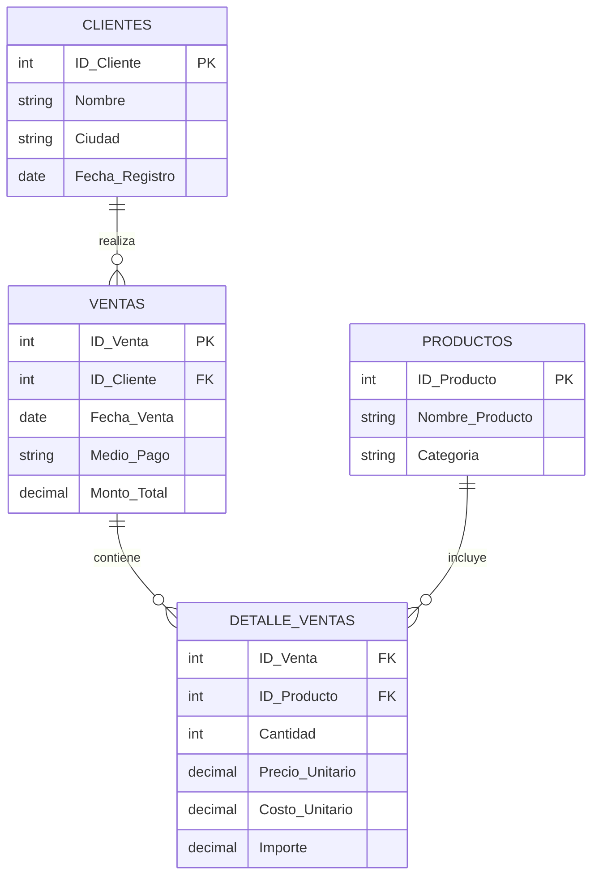

# 🚀 Proyecto Aurelion - Sistema de Análisis de Ventas

> **Autor:** Sofia Suppia  
> **Fecha:** Octubre 2025  
> **Materia:** Fundamentos de Inteligencia Artificial


---

## 🎯 Resumen 

### Tema Principal
**Análisis de datos de ventas en un market digital** (modelo JustMart) para identificar patrones de consumo, optimizar decisiones comerciales y diseñar estrategias de fidelización de clientes.

### Problema Identificado
La empresa carece de un sistema automatizado que permita responder preguntas estratégicas clave como:
- 🏆 ¿Quiénes son los clientes más valiosos?
- 📉 ¿Cuáles son los productos menos vendidos?
- 💳 ¿Qué medios de pago son más utilizados?
- 🌍 ¿Cuáles son las ciudades más rentables?

Esta limitación impide la toma de decisiones basadas en datos concretos.

### Solución Propuesta
Desarrollo de un **programa en Python** que integre múltiples fuentes de datos (Ventas, Detalles, Productos y Clientes) utilizando:
- 🐼 **Pandas** para procesamiento y análisis de datos
- 📊 **Análisis estadístico** para identificar patrones
- 🔄 **Integración automatizada** de múltiples tablas relacionales

---

## 🔍 Análisis del Problema

### 💼 Contexto Empresarial
El proyecto simula el análisis de datos de una tienda digital que necesita optimizar sus operaciones mediante insights basados en datos históricos de ventas.

### 🎯 Objetivos Específicos
1. **Identificación de clientes estratégicos** usando análisis Pareto (80/20)
2. **Optimización del inventario** mediante análisis de productos
3. **Análisis de rentabilidad geográfica** por ciudades
4. **Evaluación de métodos de pago** preferidos por los clientes

---

## 💾 Arquitectura de Datos

### 📊 Origen de los Datos
Los datos provienen de una **simulación de ventas históricas** estructurados en cuatro archivos Excel que representan las tablas principales de un sistema de ventas.

### 🗄️ Estructura de la Base de Datos

#### **Esquema Relacional**



#### **Especificaciones Técnicas**

| 📋 **Tabla** | 📈 **Registros** | 🔗 **Relaciones** | 📝 **Campos Principales** |
|:-------------|:-----------------|:-------------------|:---------------------------|
| **👥 Clientes** | 100 | PK: `ID_Cliente` | ID, Nombre, Ciudad, Fecha_Registro |
| **📦 Productos** | 100| PK: `ID_Producto` | ID, Nombre, Categoría |
| **🛒 Ventas** | 120 |PK: `ID_Venta` → FK: `ID_Cliente` | ID_Venta, Fecha, Medio_Pago, Monto |
| **📋 Detalle_Ventas** | 120 | FK: `ID_Venta`, `ID_Producto` | Cantidad, Precios, Costos, Importe |

### 🔧 Características del Dataset
- **📊 Tipo:** Simulación de Base de Datos Relacional (OLTP → OLAP)
- **📏 Escala:** Pequeña a mediana (miles de registros)
- **💾 Formato:** Archivos Excel (.xlsx)
- **🚀 Procesamiento:** Completamente en memoria con Pandas

---

## ❓ Preguntas Estratégicas Completas

### 📊 **Categoría: Análisis de Clientes**

#### 🏆 **P1: Clientes con Mayor Rentabilidad**
- **Enunciado:** ¿Quiénes son los clientes que generan un 80% de los ingresos?
- **Datos clave:** Clientes + ventas + detalle de ventas
- **Metodología:** Análisis Pareto, cálculo de ingresos acumulados y porcentajes

#### 💰 **P2: Valor Promedio de minimo y maximo de Compra de nuestros clientes Cliente**
- **Enunciado:** ¿Cuál es el promedio, mínimo y máximo de compra de nuestros clientes?
- **Datos clave:** Ventas + detalle de ventas
- **Metodología:** Promedio de monto total por transacción

#### 🛒 **P3: Frecuencia de Compra**
- **Enunciado:** ¿Qué tan frecuentes y qué productos compran los clientes más fieles?
- **Datos clave:** Detalle de ventas + productos
- **Metodología:** Análisis temporal y de productos por cliente

#### 📋 **P4: Listado de Top Clientes**
- **Enunciado:** ¿Cuál es el cliente que más compra?
- **Datos clave:** Ventas + detalle de ventas
- **Metodología:** Agrupación por cliente, suma de importes, ordenamiento descendente

### 📦 **Categoría: Análisis de Productos**

#### 🎯 **P5: Categorías con Mayor Rentabilidad**
- **Enunciado:** ¿Cuál es la categoría de productos que tiene la mayor cantidad de productos vendidos? ¿Me podes decir los ingresos de cada categoría?
- **Datos clave:** Detalle de ventas + productos
- **Metodología:** Agrupación por categoría, suma de cantidades

#### 🔍 **P6: Productos Menos Vendidos**
- **Enunciado:** Hacer lista de los 10 productos menos vendidos
- **Datos clave:** Detalle de ventas + productos
- **Metodología:** Agrupación por producto, suma de cantidades, ordenamiento ascendente

#### 💎 **P7: Productos Más Frecuentes en Primeras Compras**
- **Enunciado:** ¿Cuáles son los productos más frecuentemente consumidos en el primer pedido?
- **Datos clave:** Detalle de ventas
- **Metodología:** Identificación de primeras compras, análisis de frecuencia

### 🏙️ **Categoría: Análisis Geográfico**

#### 🌍 **P8: Distribución Geográfica de Ingresos**
- **Enunciado:** ¿Cómo se distribuyen los ingresos entre las ciudades? ¿Hay alguna ciudad que genere más ingresos?
- **Datos clave:** Ventas + clientes
- **Metodología:** Join de tablas, agrupación por ciudad

#### 📍 **P9: Volumen de Ventas por Ciudad**
- **Enunciado:** ¿Cuál es el volumen de ventas promedio de los clientes en los primeros 30 días para cada ciudad?
- **Datos clave:** Clientes, ventas, detalle de ventas
- **Metodología:** Análisis temporal por ciudad, filtros de fecha

### 💳 **Categoría: Análisis de Medios de Pago**

#### 📊 **P10: Análisis de Medios de Pago**
- **Enunciado:** ¿Cuál es el porcentaje de ventas por medio de pago y varía este porcentaje según la ciudad?
- **Datos clave:** Ventas
- **Metodología:** Cálculo de porcentajes, análisis por ciudad

#### 💰 **P11: Monto Promedio por Medio de Pago**
- **Enunciado:** Identificar los medios de pago que usan los clientes para evitar...
- **Datos clave:** Ventas
- **Metodología:** Análisis de frecuencia de medios de pago

### 📈 **Categoría: Análisis Temporal y Tendencias**

#### 📅 **P12: Estacionalidad de Ventas**
- **Enunciado:** ¿Cuál es el mes o trimestre con más ingresos?
- **Datos clave:** Ventas (cálculos con fecha)
- **Metodología:** Agrupación temporal, suma de montos

#### ⏱️ **P13: Análisis de Comportamiento de Activación de Clientes**
- **Enunciado:** ¿Cuál es el comportamiento de compra de los clientes en diferentes períodos después de registrarse en la plataforma? (30 días, 90 días, 6 meses, 1 año)
- **Datos clave:** Ventas + clientes + análisis temporal multiperíodo
- **Metodología:** Cálculo de diferencias temporales `(fecha_venta - fecha_registro).dt.days`, filtros por múltiples períodos, análisis de activación progresiva

### 💲 **Categoría: Análisis de Precios y Costos**

#### 🏷️ **P14: Análisis de Precios por Categoría**
- **Enunciado:** ¿Cuál es el precio unitario promedio de los productos por categoría?
- **Datos clave:** Detalle de ventas + productos
- **Metodología:** Agrupación por categoría, promedio de precios

#### 📈 **P15: Rentabilidad por Producto**
- **Enunciado:** ¿Cuál es el monto de compra promedio comparado con el precio unitario promedio (diferenciadas valor y volumen)?
- **Datos clave:** Detalle de ventas + productos
- **Metodología:** Análisis de márgenes y rentabilidad

---

## 💰 Metodología: Cálculo de Costo Unitario y Ganancia Bruta

### 🎯 **Objetivo**
Calcular el costo unitario y la ganancia bruta para cada producto en las ventas, utilizando numpy para análisis eficiente y identificar los productos menos rentables.

### 📐 **Fórmulas de Cálculo**

#### **Cálculo de Costo Unitario**
```python
# Fórmula principal con margen de ganancia bruta del 30%
Costo_Unitario = Precio_Unitario / 1.30

# Equivalente: Si el margen es 30%, el costo representa el 76.92% del precio
Costo_Unitario = Precio_Unitario * 0.7692
```

#### **Cálculo de Ganancia Bruta**
```python
# Fórmula de Ganancia Bruta
Ganancia_Bruta = Importe - (Costo_Unitario × Cantidad)

# Donde:
# - Importe = Ingresos totales de la venta del producto
# - Costo_Unitario = Costo calculado usando la fórmula anterior
# - Cantidad = Unidades vendidas del producto
```


### 🎯 **Justificación de la Metodología**

#### **¿Por qué Costo_Unitario = Precio_Unitario / 1.30?**

| 🧮 **Concepto** | � **Valor** | 📋 **Explicación** |
|:----------------|:-------------|:-------------------|
| **Margen de Ganancia Bruta** | 30% | Porcentaje de ganancia deseado sobre el precio de venta |
| **Factor de Cálculo** | 1.30 | Si el costo + 30% = precio, entonces precio / 1.30 = costo |
| **Porcentaje del Costo** | 76.92% | El costo representa el 76.92% del precio de venta |
| **Margen Bruto Real** | 23.08% | Porcentaje real del margen sobre el precio total |

#### **Ejemplo Práctico:**
```python
# Si un producto se vende a $100
precio_unitario = 100.00

# Costo unitario con margen del 30%
costo_unitario = precio_unitario / 1.30  # = $76.92

# Ganancia por unidad
ganancia_por_unidad = precio_unitario - costo_unitario  # = $23.08

# Margen bruto porcentual
margen_bruto = (ganancia_por_unidad / precio_unitario) * 100  # = 23.08%
```

## ⚙️ Planificación del Desarrollo

### 📁 Archivos de Entrada Requeridos

El sistema necesita los siguientes archivos para su correcto funcionamiento:

| 📄 **Archivo** | 🔧 **Campos Requeridos** | 📋 **Descripción** |
|:---------------|:--------------------------|:--------------------|
| `Clientes.xlsx` | ID_Cliente, Nombre, Ciudad, Fecha_Registro | Base de datos de clientes registrados |
| `Productos.xlsx` | ID_Producto, Nombre_Producto, Categoría | Catálogo completo de productos |
| `Ventas.xlsx` | ID_Venta, ID_Cliente, Fecha_Venta, Medio_Pago, Monto_Total | Registro de transacciones |
| `Detalle_ventas.xlsx` | ID_Venta, ID_Producto, Cantidad, Precio_Unitario, Costo_Unitario | Detalle línea por línea de cada venta |

### 🔄 Flujo de Procesamiento

1. **📥 Carga y Preparación**
   - Lectura de archivos Excel con Pandas
   - Validación de integridad de datos
   - Conversión de tipos de datos (fechas, números)
   - Simulación de `costo_unitario` (margen del 30%)

2. **🔗 Integración de Datos**
   - Joins entre tablas relacionales
   - Creación del DataFrame maestro
   - Validación de integridad referencial

3. **📊 Análisis y Resultados**
   - Implementación de análisis Pareto
   - Cálculos estadísticos por categoría
   - Generación de reportes automáticos

---

## 🔧 Implementación Técnica

### 🐍 Stack Tecnológico

| 🛠️ **Herramienta** | 📝 **Propósito** | 📋 **Funcionalidades** |
|:-------------------|:------------------|:------------------------|
| **Python 3.8+** | Lenguaje principal | Procesamiento y lógica de negocio |
| **Pandas** | Manipulación de datos | DataFrames, joins, agrupaciones |
| **NumPy** | Cálculos numéricos | Operaciones matemáticas eficientes |
| **Openpyxl** | Lectura de Excel | Importación de archivos .xlsx |


